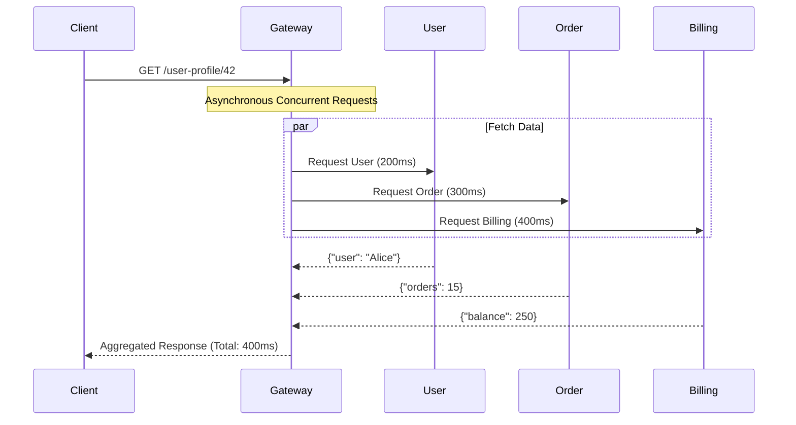

# Async / Await in Python: A Comprehensive Guide

> [!NOTE]  
> A detailed overview of how asynchronous programming solves I/O bottlenecks in modern distributed systems, complete with execution models and realistic examples.

## Table of Contents
- [What Problem Does Asynchronous Programming Solve?](#what-problem-does-asynchronous-programming-solve)
- [Synchronous vs Asynchronous](#synchronous-vs-asynchronous)
  - [1. Synchronous Execution](#1-synchronous-execution)
  - [2. Asynchronous Execution](#2-asynchronous-execution)
- [Core Concepts](#core-concepts)
  - [`async def`](#async-def)
  - [`await`](#await)
  - [Event Loop](#event-loop)
- [Sequential vs Concurrent Example](#sequential-vs-concurrent-example)
- [`asyncio.gather` vs `create_task()`](#asynciogather-vs-create_task)
- [Real Distributed Systems Example](#real-distributed-systems-example)
- [When Async Works Best](#when-async-works-best)

---

## What Problem Does Asynchronous Programming Solve?

In distributed systems, many operations spend most of their time waiting:
- waiting for an API response
- waiting for a database query
- waiting for a message from Kafka/RabbitMQ
- waiting for disk or network I/O

If we use normal synchronous code, the program **blocks** while waiting. 

Asynchronous programming allows the program to:
- pause a task during waiting
- execute other tasks meanwhile
- resume the paused task later

> [!TIP]
> **Benefits**  
> This drastically improves **throughput**, **scalability**, **latency**, and **resource efficiency**.

---

## Synchronous vs Asynchronous

### 1. Synchronous Execution

In synchronous code:
- tasks execute one after another
- each task blocks the next one

**Timeline:** Task A (3s) → Task B (2s) → Task C (1s) = **Total 6 sec**

```mermaid
gantt
    title Synchronous Execution
    dateFormat  s
    axisFormat %S
    section Tasks
    Task A (3s) :a1, 0, 3s
    Task B (2s) :a2, after a1, 2s
    Task C (1s) :a3, after a2, 1s
```



### 2. Asynchronous Execution

In asynchronous code:
- tasks can start together
- while one task waits, another runs

**Timeline:** Task A (3s), Task B (2s), Task C (1s) = **Total ≈ 3 sec**

```mermaid
gantt
    title Asynchronous Execution
    dateFormat  s
    axisFormat %S
    section Tasks
    Task A (3s) :a1, 0, 3s
    Task B (2s) :a2, 0, 2s
    Task C (1s) :a3, 0, 1s
```


*Notice how all tasks overlap, reducing the total execution time to the duration of the longest task.*

---

## Core Concepts

### `async def`

Defines a coroutine function.

```python
async def hello():
    print("Hello")
```

Calling it does NOT execute immediately.

```python
coro = hello()
print(coro)
# Output: <coroutine object hello at ...>
```

It must be awaited or scheduled to run.

### `await`

`await` pauses the coroutine until the awaited operation finishes.

```python
await asyncio.sleep(1)
```

> [!IMPORTANT]
> `await` does **not** block the whole program. It only pauses the current coroutine, returning control to the event loop so other tasks can run.

### Event Loop

The event loop is the scheduler of async programs. 
It:
- starts coroutines
- pauses them on `await`
- resumes them later
- switches between tasks efficiently

Think of its internal mechanism like this:
```python
while tasks_exist:
    run_ready_tasks()
    resume_completed_operations()
```

---

## Sequential vs Concurrent Example

### 1. Sequential Version (Slow)

```python
import asyncio
import time

async def fetch_data():
    print("Fetching user data...")
    await asyncio.sleep(2)
    return "User Data"

async def fetch_orders():
    print("Fetching orders...")
    await asyncio.sleep(3)
    return "Orders"

async def main():
    start = time.time()

    data = await fetch_data()
    orders = await fetch_orders()

    end = time.time()
    print(f"Total Time: {end - start:.2f} seconds") # 5.00 seconds

asyncio.run(main())
```
**Why 5 seconds?** Because the first task waits 2 seconds, and the second task waits 3 seconds sequentially (2 + 3 = 5).

### 2. Concurrent Version Using `asyncio.gather`

```python
import asyncio
import time

async def fetch_data():
    print("Fetching user data...")
    await asyncio.sleep(2)
    return "User Data"

async def fetch_orders():
    print("Fetching orders...")
    await asyncio.sleep(3)
    return "Orders"

async def main():
    start = time.time()

    data, orders = await asyncio.gather(
        fetch_data(),
        fetch_orders()
    )

    end = time.time()
    print(f"Total Time: {end - start:.2f} seconds") # 3.00 seconds

asyncio.run(main())
```
**Why only 3 seconds?** Because both tasks run concurrently. The total time equals the longest task.

---

## `asyncio.gather` vs `create_task()`

### `asyncio.gather`
`asyncio.gather()` runs multiple coroutines concurrently, schedules tasks together, waits for all to finish, and returns results in order.

**Best when:**
- you want all results together
- tasks are related

```python
results = await asyncio.gather(a(), b(), c())
```

### `asyncio.create_task`
**Best when:**
- tasks should run independently
- background processing
- streaming systems
- consumers/producers

```python
task = asyncio.create_task(worker())
```

---

## Real Distributed Systems Example

Imagine an API Gateway where a client requests `GET /user-profile/42`. The gateway must contact the User Service, Order Service, and Billing Service.



### Executable Realistic Example

```python
import asyncio
import random
import time

async def call_user_service():
    delay = random.randint(1, 3)
    print(f"[User Service] Taking {delay}s")
    await asyncio.sleep(delay)
    return {"user": "Alice"}

async def call_order_service():
    delay = random.randint(1, 3)
    print(f"[Order Service] Taking {delay}s")
    await asyncio.sleep(delay)
    return {"orders": 15}

async def call_billing_service():
    delay = random.randint(1, 3)
    print(f"[Billing Service] Taking {delay}s")
    await asyncio.sleep(delay)
    return {"balance": 250}

async def main():
    print("Starting API Gateway...\n")
    start = time.time()

    # Launch all requests concurrently
    user, orders, billing = await asyncio.gather(
        call_user_service(),
        call_order_service(),
        call_billing_service()
    )

    result = {**user, **orders, **billing}
    end = time.time()

    print("\nFinal Aggregated Response:", result)
    print(f"Total Response Time: {end - start:.2f}s")

if __name__ == "__main__":
    asyncio.run(main())
```

---

## When Async Works Best

> [!WARNING]
> **Async ≠ Parallelism**  
> Asynchronous programming improves waiting efficiency, usually running on a **single thread**. Parallelism uses multiple CPU cores for heavy computation.

**Excellent for (I/O-bound):**
- HTTP APIs
- WebSockets
- Message queues
- Database calls
- Distributed systems
- Streaming systems
- Microservices

**Not ideal for (CPU-bound):**
- heavy mathematical computation
- image rendering
- machine learning training

*For CPU-heavy tasks, multiprocessing, worker pools, or distributed computing are usually better.*

---

## Simplified Mental Model

> [!TIP]
> **Think of async as:**
> *"Start a task. If it waits, work on something else meanwhile."*

That simple rule is exactly why async is foundational in modern distributed systems.
