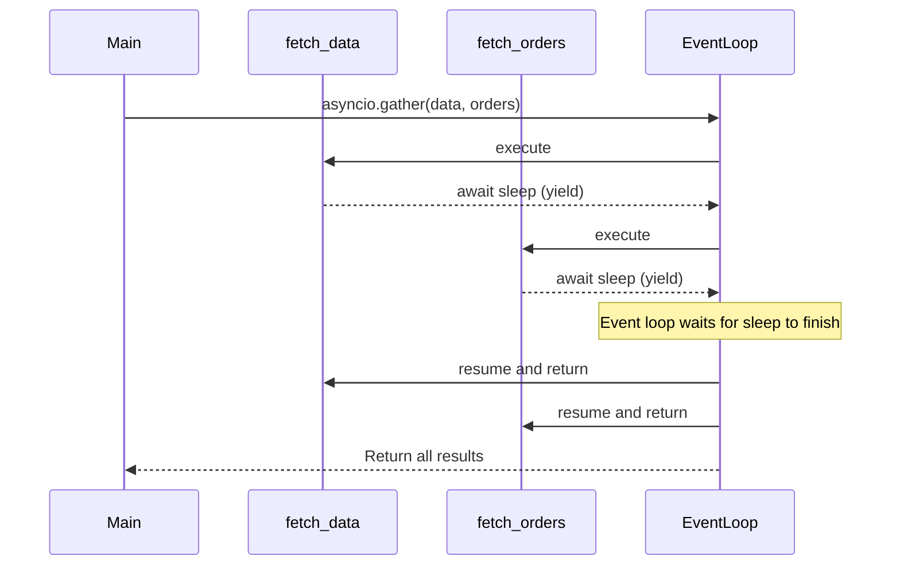

# `async`/`await` in Python

## Concept Explanation
The `async` and `await` keywords are Python's native syntax for writing asynchronous code. 
- `async def` defines a **coroutine function**. When called, it doesn't run immediately; it returns a coroutine object.
- `await` is used inside an `async def` function to pause its execution until the awaited coroutine or task is complete. It yields control back to the event loop.

To run concurrently, coroutines are often wrapped in tasks (using `asyncio.create_task` or `asyncio.gather`). 

## Python Example

```python
import asyncio

async def fetch_user_data(user_id):
    print(f"Fetching data for user {user_id}...")
    await asyncio.sleep(1) # Simulates network delay
    return {"id": user_id, "name": f"User_{user_id}"}

async def fetch_user_orders(user_id):
    print(f"Fetching orders for user {user_id}...")
    await asyncio.sleep(1.5) # Simulates network delay
    return ["Order 1", "Order 2"]

async def main():
    user_id = 42
    
    # Run both network calls concurrently using asyncio.gather
    data_task, orders_task = await asyncio.gather(
        fetch_user_data(user_id),
        fetch_user_orders(user_id)
    )
    
    print("Results:", data_task, orders_task)

if __name__ == "__main__":
    asyncio.run(main())
```

## Production Distributed Systems Use Case
In an API Gateway layer built with FastAPI, when a client requests a composite "User Profile" view, the server needs to fetch data from the User Service, the Billing Service, and the Order Service. Using `async`/`await` with `asyncio.gather`, the gateway can make all three downstream HTTP requests concurrently, reducing the total response time to the duration of the slowest downstream service, rather than the sum of all three.

## Diagram


