# Concurrency vs Parallelism

> [!NOTE]
> Why This Distinction Matters: In distributed systems, handling many requests efficiently is critical. But there are two very different ways systems improve performance: **Concurrency** (efficiently managing many tasks) and **Parallelism** (executing many tasks simultaneously).

## Table of Contents
- [Simple Analogy](#simple-analogy)
- [Core Difference](#core-difference)
- [Concurrency](#concurrency)
  - [How Concurrency Works in Python](#how-concurrency-works-in-python)
  - [Executable Concurrency Example (`asyncio`)](#executable-concurrency-example-asyncio)
- [Parallelism](#parallelism)
  - [Python and the GIL](#python-and-the-gil)
  - [Executable Parallelism Example (`multiprocessing`)](#executable-parallelism-example-multiprocessing)
- [Visual Comparison](#visual-comparison)
- [Distributed Systems Perspective](#distributed-systems-perspective)
  - [Real Production Architecture](#real-production-architecture)
- [Common Misconception](#common-misconception)
- [Rule of Thumb](#rule-of-thumb)
- [Final Mental Model](#final-mental-model)

---

## Simple Analogy

### Concurrency = One Chef Managing Many Orders
A single chef starts cooking pasta, while water boils chops vegetables, and while vegetables cook prepares sauce. Only one chef exists, but many tasks progress over time. This is concurrency.

### Parallelism = Multiple Chefs Cooking Together
Now imagine one chef cooks pasta, another grills steak, another prepares dessert. Tasks truly happen at the same time. This is parallelism.

---

## Core Difference

| Feature | Concurrency | Parallelism |
| :--- | :--- | :--- |
| **Goal** | Manage many tasks efficiently | Execute many tasks simultaneously |
| **Focus** | Task coordination | Speed through hardware |
| **Requires multiple CPU cores?** | No | Yes |
| **Best for** | I/O-bound tasks | CPU-bound tasks |
| **Common Python Tool** | `asyncio` | `multiprocessing` |
| **Execution** | Tasks take turns | Tasks run literally together |
| **Typical Use Case** | APIs, databases, sockets | ML, image processing, simulations |

---

## Concurrency

### Definition
Concurrency means multiple tasks make progress during overlapping time periods. The tasks may pause, resume later, and share one CPU core. The important idea is that tasks are **interleaved**.

### How Concurrency Works in Python
Python concurrency is commonly implemented using `asyncio`, event loops, coroutines, and `async` / `await`. The event loop switches between tasks whenever a task is waiting.

**Concurrency Timeline:**
Imagine two API calls (Task A: waiting for database, Task B: waiting for HTTP request). Even on ONE CPU core, both tasks progress together and waiting time is utilized efficiently.

### Executable Concurrency Example (`asyncio`)
This example runs on a single thread.

```python
import asyncio
import time

async def task(name, delay):
    print(f"Task {name} started")
    await asyncio.sleep(delay)
    print(f"Task {name} finished")

async def main():
    start = time.time()
    await asyncio.gather(
        task("A", 2),
        task("B", 2),
        task("C", 2)
    )
    end = time.time()
    print(f"\nTotal Time: {end - start:.2f} seconds")

if __name__ == "__main__":
    asyncio.run(main())
```

**Expected Output:**
```text
Task A started
Task B started
Task C started
Task A finished
Task B finished
Task C finished

Total Time: 2.00 seconds
```

> [!TIP]
> **Why Is This Concurrent?**
> Even though only one thread exists and one core may be used, the tasks overlap because `await asyncio.sleep()` yields control and the event loop switches tasks.

**(Sequential Version For Comparison):**
If run sequentially without `gather`, the total time would be `6.00 seconds` because tasks execute one after another.

---

## Parallelism

### Definition
Parallelism means multiple tasks execute at the exact same moment. This requires multiple CPU cores, multiple machines, or distributed workers.

### Python and the GIL
Python has something called the Global Interpreter Lock (GIL). This means threads cannot execute Python bytecode truly in parallel; threading is limited for CPU-heavy work. Because of this:
- **I/O-bound:** Recommended `asyncio` or `threading`
- **CPU-bound:** Recommended `multiprocessing`

### Executable Parallelism Example (`multiprocessing`)
Now we use multiple CPU processes.

```python
import multiprocessing
import time

def cpu_task(name):
    print(f"Process {name} started")
    time.sleep(2)
    print(f"Process {name} finished")

if __name__ == "__main__":
    start = time.time()
    processes = []

    for name in ["A", "B", "C"]:
        p = multiprocessing.Process(target=cpu_task, args=(name,))
        processes.append(p)
        p.start()

    for p in processes:
        p.join()

    end = time.time()
    print(f"\nTotal Time: {end - start:.2f} seconds")
```

**Expected Output:**
```text
Process A started
Process B started
Process C started
Process A finished
Process B finished
Process C finished

Total Time: 2.00 seconds
```

> [!TIP]
> **Why Is This Parallel?**
> Because separate OS processes are created, different CPU cores can execute simultaneously, and work truly happens at the same time.

---

## Visual Comparison

### Sequential
Tasks execute one after another.

```mermaid
gantt
    title Sequential
    dateFormat  s
    axisFormat %S
    section Tasks
    Task A (2s) :a1, 0, 2s
    Task B (2s) :a2, after a1, 2s
    Task C (2s) :a3, after a2, 2s
```

*Total = 6s*

### Concurrent (`asyncio`)
Tasks overlap while waiting.

*Total = 2s*

### Parallel (`multiprocessing`)
Tasks truly execute simultaneously across different hardware.

```mermaid
gantt
    title Parallel
    dateFormat  s
    axisFormat %S
    section CPU Cores
    Core 1 - Task A :a1, 0, 2s
    Core 2 - Task B :a2, 0, 2s
    Core 3 - Task C :a3, 0, 2s
```

*Total = 2s*

---

## Distributed Systems Perspective
Modern distributed systems use BOTH.

**Concurrency in Distributed Systems**
Used for handling thousands of connections, async APIs, WebSockets, Kafka consumers, message brokers, and API gateways. (Example: FastAPI, Node.js, NGINX, Redis). One server efficiently manages many network requests.

**Parallelism in Distributed Systems**
Used for data processing clusters, Spark jobs, AI training, distributed computation, and video rendering. (Example: Kubernetes replicas, Hadoop workers, Spark executors). Multiple machines compute together.

### Real Production Architecture
Imagine a streaming platform.
- **Concurrency Layer:** Each server handles 50,000 websocket connections; the async event loop manages connections.
- **Parallelism Layer:** Platform deploys 100 servers across many CPU cores and machines.
Now concurrency handles connections efficiently, and parallelism scales total throughput.

---

## Common Misconception
> [!WARNING]
> **"Async makes code faster"**
> Not always. Async does NOT speed up CPU computation; it speeds up waiting-heavy workloads. If there is no waiting, async may provide no benefit.

---

## Rule of Thumb

**Use Concurrency (`asyncio`) When:**
- tasks spend time waiting
- APIs
- databases
- sockets
- distributed systems
- streaming systems

**Use Parallelism (`multiprocessing`) When:**
- tasks use heavy CPU
- image processing
- AI
- simulations
- scientific workloads

---

## Final Mental Model

- **Concurrency:** "One worker efficiently juggles many tasks."
- **Parallelism:** "Multiple workers execute tasks simultaneously."

> [!IMPORTANT]
> **Most Modern Systems Use Both**
> A modern distributed system typically uses concurrency inside each service, and uses parallelism across cores/machines. That combination enables systems like Netflix, Uber, Amazon, Discord, Kafka, and Kubernetes to scale to millions of users.
