# Concurrency vs Parallelism

## Concept Explanation
- **Concurrency** is about *dealing* with many things at once. It’s a structural concept where a system is designed to manage multiple tasks that overlap in time. The tasks don't have to execute at the exact same millisecond; they just take turns quickly (like an event loop switching between async tasks).
- **Parallelism** is about *doing* many things at once. It requires multiple physical resources (like multi-core CPUs) to execute multiple computations literally at the exact same time.

You can have concurrency without parallelism (asyncio on a single core), parallelism without concurrency (a single massive math operation split across cores), or both.

## Python Example

```python
import asyncio
import multiprocessing
import time

# Concurrency (Asyncio - Single Core)
async def concurrent_task(name):
    print(f"Start concurrent task {name}")
    await asyncio.sleep(1)  # Simulates I/O, yields control
    print(f"End concurrent task {name}")

async def run_concurrent():
    await asyncio.gather(concurrent_task("A"), concurrent_task("B"))

# Parallelism (Multiprocessing - Multi-Core)
def parallel_task(name):
    print(f"Start parallel task {name}")
    time.sleep(1)  # Simulates CPU-heavy work, blocks the core
    print(f"End parallel task {name}")

def run_parallel():
    processes = []
    for name in ["A", "B"]:
        p = multiprocessing.Process(target=parallel_task, args=(name,))
        processes.append(p)
        p.start()
    for p in processes:
        p.join()
```

## Production Distributed Systems Use Case
In a modern microservices architecture, a single worker node will use **concurrency** (async event loops) to handle thousands of simultaneous network connections (API requests). However, to scale across the cluster, the system uses **parallelism** by deploying multiple instances of that worker node across different physical machines or CPU cores.

## Diagram

```mermaid
gantt
    title Concurrency (Single Core) vs Parallelism (Dual Core)
    dateFormat  s
    axisFormat %S
    
    section Concurrency
    Task 1 (I/O)    :active, a1, 0, 2s
    Task 2 (I/O)    :active, a2, 0, 2s
    Note: Tasks take turns yielding on a single core
    
    section Parallelism
    Core 1 - Task 1 :crit, b1, 0, 2s
    Core 2 - Task 2 :crit, b2, 0, 2s
    Note: Tasks execute exactly at the same time
```


