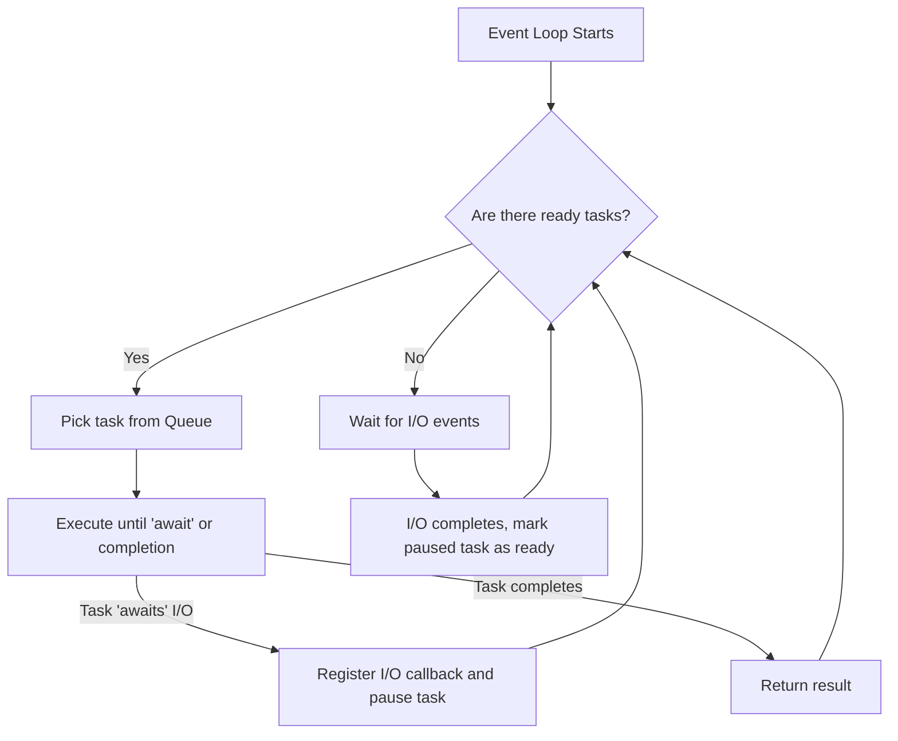

# Event Loop

## Concept Explanation
The **Event Loop** is the core engine of asynchronous programming. You can think of it as an infinite loop running in a single thread that constantly checks if there are tasks ready to be executed. 
When an async function hits an `await` keyword (e.g., waiting for network I/O), it yields control back to the event loop. The event loop then looks at its queue of other tasks and runs the next one that is ready. This mechanism is called **cooperative scheduling**, because tasks must explicitly yield control (cooperate) for the system to work.

## Python Example

```python
import asyncio

async def task_a():
    print("Task A: Starting work")
    # Yield control to the event loop while waiting
    await asyncio.sleep(1)
    print("Task A: Resumed and finished")

async def task_b():
    print("Task B: Starting work")
    await asyncio.sleep(0.5)
    print("Task B: Resumed and finished")

async def main():
    # The event loop manages both tasks concurrently
    await asyncio.gather(task_a(), task_b())

# asyncio.run() starts the event loop
if __name__ == "__main__":
    asyncio.run(main())
```

## Production Distributed Systems Use Case
In systems like **Node.js** or Python's **FastAPI**, the event loop is what allows a single process to handle tens of thousands of concurrent client connections. When a client requests data from a database, the route handler `awaits` the DB query. The event loop pauses that request and picks up the next incoming HTTP request, ensuring the server never stops accepting connections.

## Diagram


