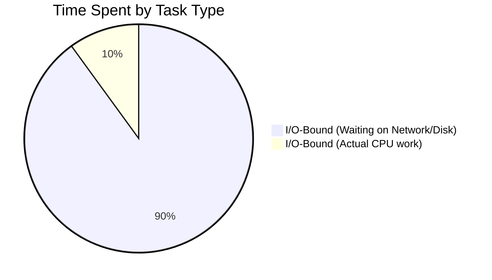
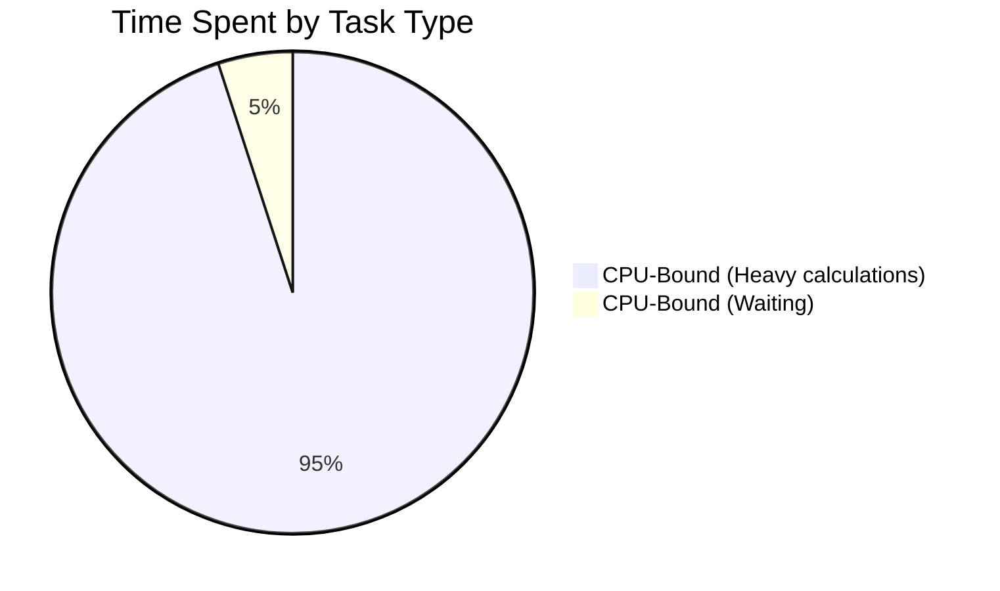

# I/O-bound vs CPU-bound

## Concept Explanation
Tasks in a computer system fall into two primary categories based on what limits their performance:
- **I/O-bound tasks**: The program spends most of its time waiting for input/output operations to complete (e.g., reading from a database, making HTTP requests, writing to disk). The CPU is mostly idle.
- **CPU-bound tasks**: The program spends most of its time performing heavy calculations (e.g., image processing, training ML models, encrypting data). The CPU is maxed out.

*Crucial distinction:* Async programming is the perfect solution for I/O-bound tasks because it allows the idle CPU to do other work while waiting. However, async does **not** help CPU-bound tasks. If a task is crunching numbers, it blocks the thread completely, meaning the event loop cannot run other tasks.

## Python Example

```python
import asyncio
import time

# I/O-bound task (Async works great!)
async def io_bound_task():
    print("Start I/O task")
    await asyncio.sleep(1) # Simulates waiting for network
    print("End I/O task")

# CPU-bound task (Async fails here, blocks the loop!)
def cpu_bound_task():
    print("Start CPU task")
    # Doing heavy math blocks the whole event loop
    result = sum(i * i for i in range(10_000_000))
    print("End CPU task")

async def main():
    # The CPU-bound task will block the event loop, 
    # preventing the I/O tasks from running concurrently.
    print("If we run cpu_bound_task() here, everything freezes.")
```

## Production Distributed Systems Use Case
In a system that processes uploaded videos (like YouTube), the microservices are split by bound-types.
1. The **API Gateway** (I/O-bound) handles thousands of user uploads and database writes. It uses asynchronous frameworks (like Node.js or FastAPI) to maximize throughput while waiting on network packets.
2. The **Video Transcoder Worker** (CPU-bound) takes the raw video and compresses it. This runs on separate, powerful servers using Multiprocessing or compiled languages (like C++ or Rust), because async would not speed up video compression.

## Diagram



