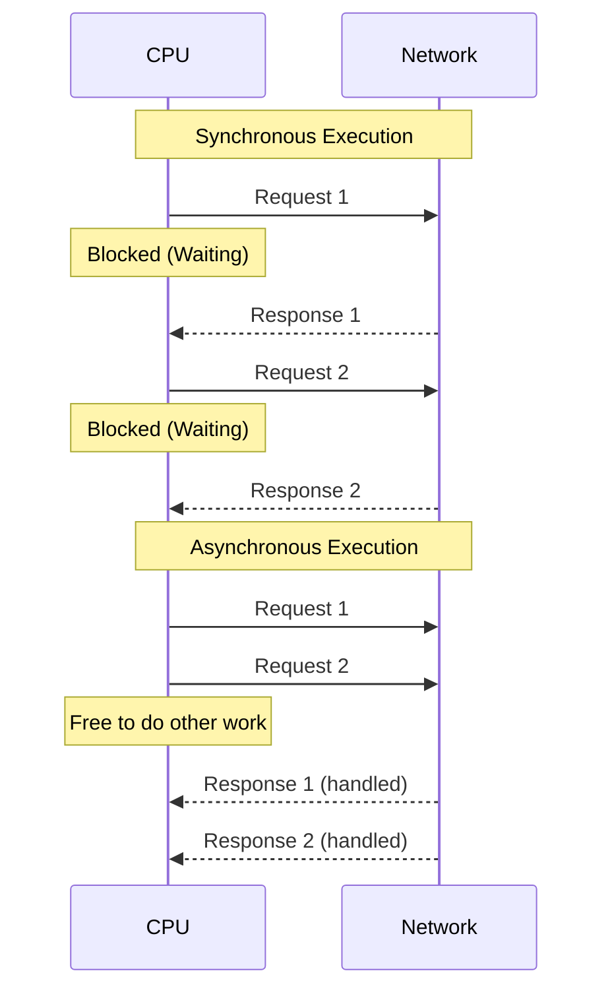

# Sync vs Async Execution

## Concept Explanation
**Synchronous (Sync) Execution** means code is executed sequentially, line by line. If a task involves waiting (like a network request or reading a file), the entire program or thread blocks and waits until the task finishes. This is straightforward but can waste CPU cycles because the CPU sits idle while waiting for the I/O operation.

**Asynchronous (Async) Execution** means that when a task involves waiting, the program can "pause" that task, free up the thread, and move on to execute other tasks. Once the waiting task finishes, the program is notified and resumes its execution. This is highly efficient for I/O-heavy operations as it maximizes CPU utilization without needing multiple threads.

## Python Example

```python
import time
import asyncio

# Synchronous Example
def sync_fetch_data():
    print("Start fetching data (sync)...")
    time.sleep(2)  # Blocks the entire thread
    print("Done fetching data (sync)!")

def run_sync():
    sync_fetch_data()
    sync_fetch_data() # Waits for the first to finish

# Asynchronous Example
async def async_fetch_data():
    print("Start fetching data (async)...")
    await asyncio.sleep(2)  # Yields control back to the event loop
    print("Done fetching data (async)!")

async def run_async():
    # Both start concurrently, neither blocks the other
    await asyncio.gather(async_fetch_data(), async_fetch_data())
```

## Production Distributed Systems Use Case
In a production web scraper or API gateway, using async execution allows a single server to handle thousands of simultaneous outgoing HTTP requests. Instead of spawning 10,000 threads (which would crash the server due to memory overhead), an async system uses one thread to fire all requests and handle the responses as they arrive. 

## Diagram


