# Sync vs Async Execution

> [!NOTE]
> One of the most fundamental concepts in distributed systems is understanding why asynchronous systems scale better than synchronous ones.

## Table of Contents
- [Why This Comparison Matters](#why-this-comparison-matters)
- [Synchronous Execution (Sync)](#synchronous-execution-sync)
- [Asynchronous Execution (Async)](#asynchronous-execution-async)
- [Side-by-Side Comparison](#side-by-side-comparison)
- [Real Distributed Systems Example](#real-distributed-systems-example)
- [Why Async Scales Better](#why-async-scales-better)
- [Important Limitation: Async Is NOT Magic](#important-limitation-async-is-not-magic)
- [Final Mental Model](#final-mental-model)

## Why This Comparison Matters
Modern systems like FastAPI, Node.js, NGINX, Redis, and Kafka clients all rely heavily on asynchronous execution. Understanding the difference explains:
- why async servers handle massive traffic
- why blocking code kills scalability
- why event loops exist

---

## Synchronous Execution (Sync)

### Definition
Synchronous execution means:
- Tasks execute one after another.
- Each task must fully finish before the next begins.

If a task waits:
- the entire thread waits
- the CPU may become idle

> [!TIP]
> **Simple Mental Model: Standing in Line**
> Imagine a supermarket with one cashier. Customers must wait for the current customer to finish payment before the next customer proceeds. Everything is sequential.

### Example Timeline (Sync)
Two network requests (Request A = 2s, Request B = 2s)

```mermaid
gantt
    title Synchronous Execution
    dateFormat  s
    axisFormat %S
    section Requests
    Request A (2s) :a1, 0, 2s
    Request B (2s) :a2, after a1, 2s
```


*Total = 4s*

### Synchronous Python Example
```python
import time

def fetch_data(name):
    print(f"{name}: Start fetching")
    time.sleep(2)
    print(f"{name}: Done fetching")

start = time.time()
fetch_data("Request A")
fetch_data("Request B")
end = time.time()

print(f"\nTotal Time: {end - start:.2f} seconds")
```
**Expected Output:**
```text
Request A: Start fetching
Request A: Done fetching
Request B: Start fetching
Request B: Done fetching

Total Time: 4.00 seconds
```

### Problem with Sync Execution
While waiting (`time.sleep(2)`), the thread is **blocked**. Meaning no other work happens, the CPU may sit idle, and throughput suffers badly. This becomes disastrous at scale.

---

## Asynchronous Execution (Async)

### Definition
Asynchronous execution means:
- When a task waits, the system switches to another task instead of blocking.
- Tasks overlap in time.

> [!TIP]
> **Simple Mental Model: Restaurant Pager System**
> You order food. The kitchen prepares it. Instead of standing there waiting, you sit down and do other things. When food is ready, you are notified and resume. This is async execution.

### Example Timeline (Async)
Same requests (Request A = 2s, Request B = 2s)

```mermaid
gantt
    title Asynchronous Execution
    dateFormat  s
    axisFormat %S
    section Requests
    Request A (2s) :a1, 0, 2s
    Request B (2s) :a2, 0, 2s
```


*Total = 2s. Both overlap.*

### Async Python Example
```python
import asyncio
import time

async def fetch_data(name):
    print(f"{name}: Start fetching")
    await asyncio.sleep(2)
    print(f"{name}: Done fetching")

async def main():
    start = time.time()
    await asyncio.gather(
        fetch_data("Request A"),
        fetch_data("Request B")
    )
    end = time.time()
    print(f"\nTotal Time: {end - start:.2f} seconds")

if __name__ == "__main__":
    asyncio.run(main())
```
**Expected Output:**
```text
Request A: Start fetching
Request B: Start fetching
Request A: Done fetching
Request B: Done fetching

Total Time: 2.00 seconds
```

### Why Async Is Faster Here
Because during `await asyncio.sleep(2)` the coroutine pauses. The event loop frees the thread and runs another task meanwhile. No CPU time is wasted.

---

## Side-by-Side Comparison

| Feature | Sync | Async |
| :--- | :--- | :--- |
| **Execution Style** | Sequential | Overlapping |
| **Waiting Behavior** | Blocks thread | Yields control |
| **CPU Usage** | Often idle | Better utilization |
| **Scalability** | Lower | Higher |
| **Complexity** | Simpler | More complex |
| **Best For** | Small/simple apps | High-concurrency systems |
| **Typical Use Cases** | Scripts, CPU tasks | APIs, sockets, distributed systems |

### Key Difference
- **Sync:** "Wait here until this finishes."
- **Async:** "While this waits, do something else."

---

## What `await` Actually Does

> [!IMPORTANT]
> This is critical to understand.

**Blocking Sleep (`time.sleep(2)`)**
- blocks entire thread
- nothing else runs

**Async Sleep (`await asyncio.sleep(2)`)**
- pauses current coroutine
- event loop runs other tasks
- thread stays productive

When `await database_query()` executes, the event loop pauses the coroutine, registers a callback, runs another task, and resumes the coroutine later. This is the foundation of async systems.

---

## Real Distributed Systems Example

Imagine an API Gateway.
Client requests: `GET /profile`
Gateway must contact: User Service, Billing Service, Order Service

### Synchronous Gateway
Wait User Service, then wait Billing Service, then wait Order Service.
**Latency:** 200ms + 300ms + 400ms = **900ms**

### Asynchronous Gateway
All requests start together.
**Latency:** max(200ms, 300ms, 400ms) = **400ms**
Massive improvement.

---

## Why Async Scales Better

**Traditional thread-per-request servers:**
- 1 request = 1 thread
- 10,000 requests = 10,000 threads, huge memory usage, expensive context switching.

**Async Servers:**
- 1 thread, many coroutines
- 10,000 requests = lightweight coroutines, minimal memory, efficient scheduling.
This is why async servers scale extremely well.

### Real Technologies Using Async
| Technology | Async Model |
| :--- | :--- |
| FastAPI | `asyncio` |
| Node.js | event loop |
| NGINX | event-driven |
| Redis | async event loop |
| Kafka clients | async polling |
| Discord servers | async sockets |

---

## Important Limitation: Async Is NOT Magic

> [!WARNING]
> Async improves waiting-heavy workloads. Async does **NOT** improve heavy computation.

### Example Where Async Fails
```python
async def cpu_task():
    for i in range(10**9):
        pass
```
**Problem:** no waiting, no yielding, event loop blocked. Other async tasks freeze.

CPU-bound Tasks Need Parallelism. Use `multiprocessing`, worker pools, or distributed compute systems instead.

### Sync vs Async in Distributed Systems
| System Type | Preferred Model |
| :--- | :--- |
| REST APIs | Async |
| WebSockets | Async |
| Message Brokers | Async |
| Database Clients | Async |
| Video Encoding | Parallelism |
| ML Training | Parallelism |
| Simulations | Parallelism |

### Common Beginner Mistake
"Async means parallel" -> False.
- **Async** usually runs on ONE thread, tasks overlap by yielding control.
- **Parallelism** uses multiple CPU cores simultaneously.

---

## Final Mental Model

### The Big Advantage of Async
Async systems maximize CPU utilization during waiting periods. That is exactly why async dominates distributed systems, microservices, API gateways, real-time systems, and high-concurrency servers.

- **Synchronous Execution:** "Do one task completely before starting another."
- **Asynchronous Execution:** "When a task waits, switch to another one."

That simple shift is what enables modern systems to efficiently handle millions of concurrent operations.
