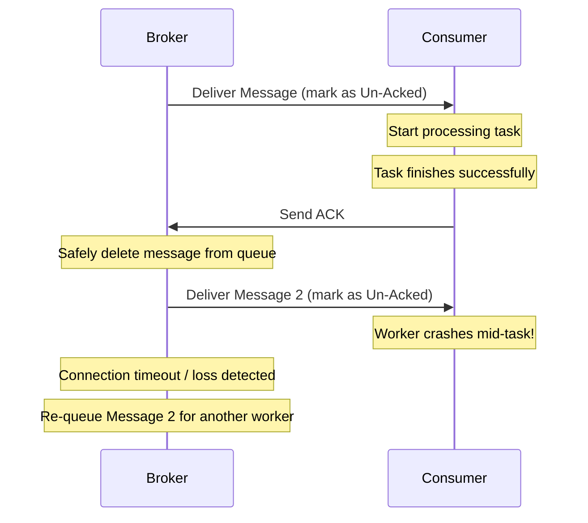

# Acknowledgement (ACK)

> [!NOTE]  
> An Acknowledgement (ACK) is a signal sent from the consumer back to the message broker to indicate that a message has been successfully processed. 

## Concept Explanation

When a broker sends a message to a consumer, it doesn't instantly delete it. Instead, it marks the message as **"unacknowledged"** or **"in-flight"**. 

- If the consumer finishes its job, it sends an ACK, and the broker safely deletes the message. 
- If the consumer crashes or times out before sending the ACK, the broker automatically re-queues the message so another worker can try.

## Distributed Systems Use Case

> [!TIP]
> **Resilient Payment Processing**  
> In a payment processing system, a worker takes a `process_refund` message. Halfway through talking to the bank's API, the worker's server suffers a power outage. Because the worker never sent an ACK, the message broker realizes the connection dropped. The broker places the message back in the queue, and a surviving worker picks it up and processes the refund, ensuring financial consistency.

## Message Lifecycle Diagram

