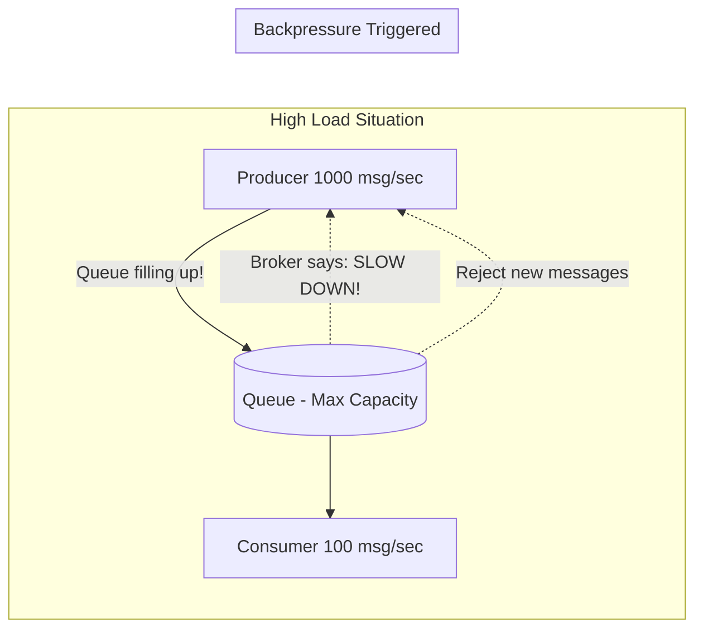

# Backpressure

## Concept Explanation
Backpressure is a mechanism to handle situations where the Producer is generating messages much faster than the Consumer can process them. Without backpressure, the message queue grows infinitely, eventually running out of memory (OOM) and bringing the whole broker down.
Backpressure strategies include:
- **Blocking the producer**: The broker tells the producer "I am full, stop sending for a moment."
- **Dropping messages**: Shedding load by discarding the oldest or least important messages.
- **Scaling consumers**: Automatically spinning up more worker nodes to drain the queue faster.

## Distributed Systems Use Case
During a flash sale on an e-commerce site, the incoming web requests (Producers) might surge to 10,000 per second. The inventory database can only handle 1,000 writes per second. If the queue hits its memory limit, it exerts backpressure by rejecting new HTTP requests (returning a `429 Too Many Requests` or `503 Service Unavailable`), saving the database from an apocalyptic crash.

## Diagram

