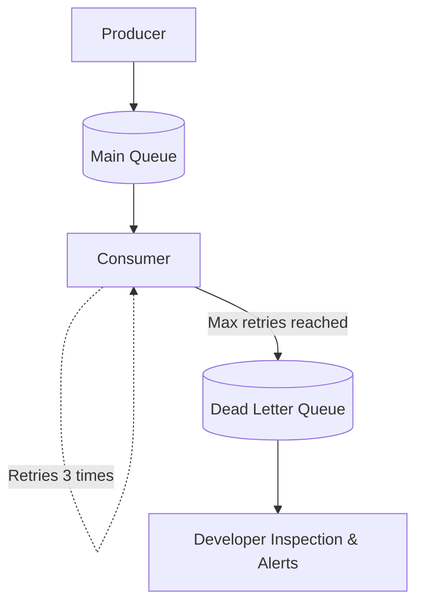

# Dead Letter Queue (DLQ)

## Concept Explanation
A Dead Letter Queue (DLQ) is a special holding queue where messages are sent when they cannot be processed successfully after a certain number of retries, or if they are structurally invalid.
Instead of an infinite loop of a broken message crashing a worker, being re-queued, and crashing the next worker (a "poison pill"), the broker removes the message from the main queue and parks it in the DLQ. Engineers can then inspect the DLQ to figure out what went wrong.

## Distributed Systems Use Case
If a system receives a webhook containing a malformed JSON payload, the worker will throw a parsing error. After 3 retries, the broker moves the message to the DLQ. Developers set up alerts on the DLQ; when an alert fires, they can manually inspect the bad JSON, realize the external API changed its format, patch the worker code, and replay the message from the DLQ.

## Diagram

