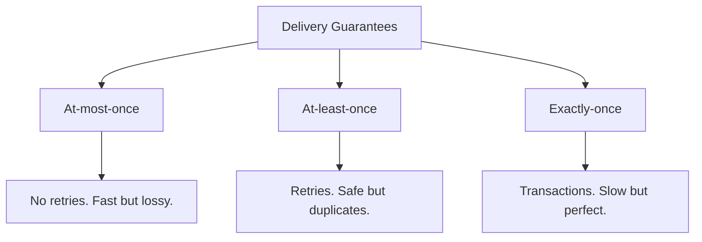

# Delivery Guarantees

## Concept Explanation
Message delivery semantics describe the guarantees a distributed system makes about a message successfully traveling from producer to consumer.
1. **At-most-once (Fire and Forget):** A message is sent once. If it gets lost in the network or the worker crashes, it's gone forever. Lowest latency, lowest reliability.
2. **At-least-once:** The system ensures the message will be processed. If a worker crashes before ACKing, it is retried. This means a message might be processed *multiple* times. Consumers must be idempotent (safe to run twice).
3. **Exactly-once:** The holy grail. A message is delivered and processed exactly one time, no matter what crashes. This is incredibly complex and requires tight coordination between the producer, broker, and consumer's database.

## Distributed Systems Use Case
- **At-most-once:** Processing IoT sensor data for temperature. If you lose one second's reading out of 10,000, it doesn't matter.
- **At-least-once:** Processing an image upload. If it processes twice, you just overwrite the same image. No harm done. (Industry standard for most queues like RabbitMQ).
- **Exactly-once:** Financial transactions. You cannot charge a credit card twice for the same order, nor can you lose the transaction. (Often handled by Kafka streams with transactional IDs).

## Diagram

