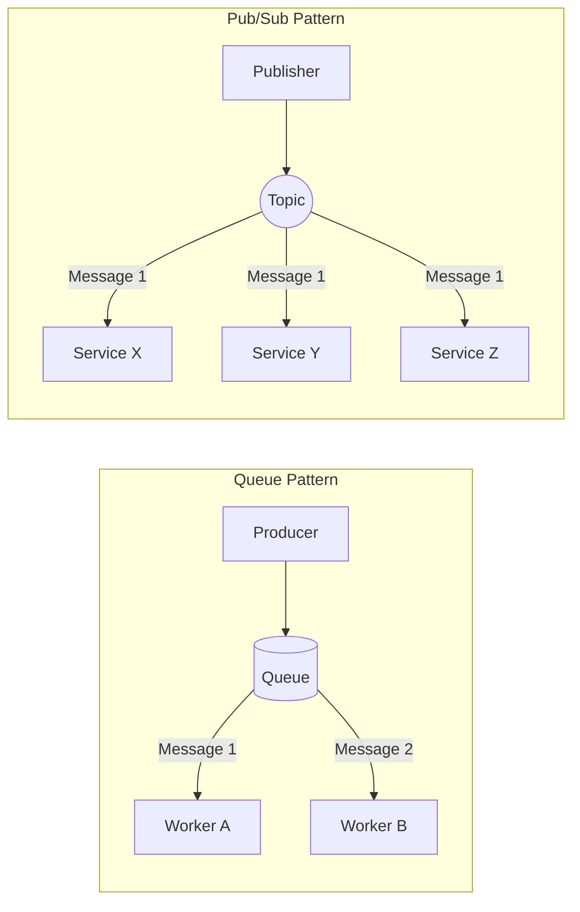

# Queue vs Pub/Sub

> [!NOTE]  
> These are the two primary messaging patterns supported by message brokers.

## The Two Patterns

- **Queue (Point-to-Point):** A message is sent to a specific queue, and it is consumed by exactly **one** consumer. Even if there are 10 workers listening to the queue, the broker ensures only one worker gets the message. Ideal for distributing tasks.
- **Pub/Sub (Publish/Subscribe):** A message is sent to a "topic" or "exchange". It is broadcasted to **all** subscribers currently listening to that topic. Ideal for event notifications.

## Distributed Systems Use Cases

- **Queue Use Case:** Video encoding. You have a queue of videos to compress. If you have 5 encoding servers, you want *one* server to process a specific video, not all 5 servers compressing the same video simultaneously.
- **Pub/Sub Use Case:** User sign-up. When a user registers, the event `user_created` is published. The Email Service subscribes to send a welcome email, the Analytics Service subscribes to update metrics, and the CRM Service subscribes to create a profile. All of them receive the same message.

## Pattern Flow Diagram

