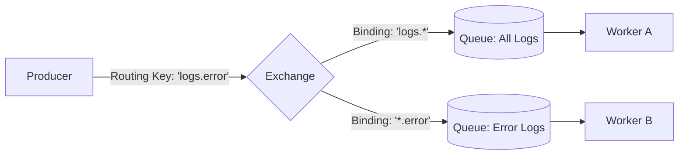

# RabbitMQ Architecture

## Concept Explanation
RabbitMQ is a robust, widely-used, open-source message broker that implements the AMQP (Advanced Message Queuing Protocol). It is designed purely to move messages securely and reliably from producers to consumers.

RabbitMQ introduces the concept of **Exchanges**, which are routing engines. Producers don't send messages directly to queues; they send them to an Exchange, which uses rules (bindings and routing keys) to determine which queue(s) should receive the message.

## Architecture & Components
1. **Producer:** Sends messages to an Exchange.
2. **Exchange:** Routes messages to Queues based on patterns (Direct, Topic, Fanout, Headers).
3. **Binding:** The link and rule set connecting an Exchange to a Queue.
4. **Queue:** The buffer that stores the messages on disk/memory until consumed.
5. **Consumer:** Reads messages from the queue and sends ACKs.

## Diagram

