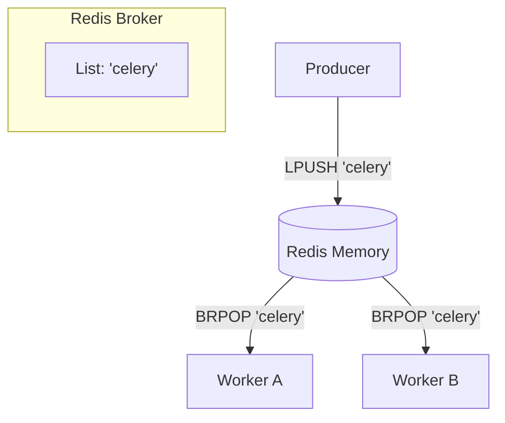

# Redis (as a Message Broker)

> [!NOTE]  
> Redis is primarily an in-memory Key-Value data store. However, because it operates entirely in RAM and is blisteringly fast, it is often used as a lightweight message broker, especially in the Python/Celery ecosystem.

## Concept Explanation

Redis supports queuing via its native data structures:
- **Lists (`LPUSH` / `BRPOP`):** Used for basic point-to-point queues. A producer pushes to the left, a worker blocks and pops from the right.
- **Pub/Sub:** Used for broadcasting messages.
- **Streams:** A newer append-only log data structure (similar to Kafka) that supports Consumer Groups and persistence.

> [!IMPORTANT]
> Unlike RabbitMQ, standard Redis Lists do not have robust native ACK mechanisms or complex routing. Frameworks like Celery implement their own ACK and retry logic on top of Redis to make it behave like a reliable broker.

## Architecture & Components

1. **In-Memory Store:** All messages are kept in RAM (with optional disk persistence).
2. **List Data Structure:** Acts as the queue.
3. **Visibility Timeout:** A mechanism Celery uses in Redis to simulate un-acked messages by copying them to a temporary queue.

## Redis List Queue Diagram

